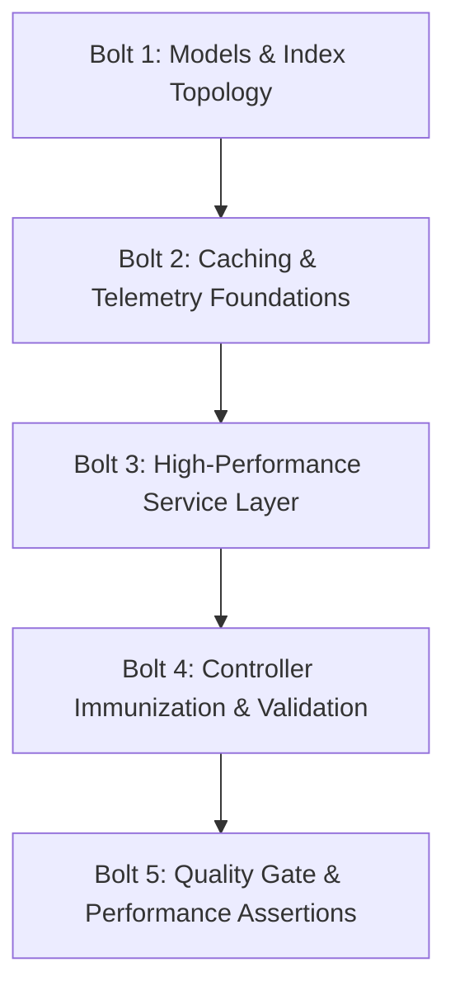

# Stage 2: Delivery & Integration Plan (Bolt Plan)

**Agent:** `aidlc-delivery-agent`  
**Target:** AI Assistant & AI ISA Feature Domain  
**Codebase State:** Currently unchanged — zero repository modifications executed during Stages 1 and 2.

This delivery specification translates the Stage 1 adversarial audit findings into a sequenced, deterministic execution plan designed to clear all latency multipliers while guaranteeing **zero functional regression**.

---

## 1. The Integration Sequence (Bolt Plan)

The refactoring must proceed in 5 strictly ordered Bolts. Foundational schemas and caching layers must land before controllers and services are modified to avoid circular dependencies and runtime crashes.



### Bolt 1: Models & Compound Index Topology
- **Objective:** Eliminate `COLLSCAN` queries and strip write-amplifying redundant single-field indexes across all AI collections.
- **Tasks:**
  1. Update `server/src/models/AiIsaConfig.ts`: Remove redundant `index: true` on unique `brokerageId`.
  2. Update `server/src/models/QualificationCriteria.ts`: Remove redundant single-field index on `brokerageId`; retain `{ brokerageId: 1, order: 1 }`.
  3. Update `server/src/models/ReactivationCampaign.ts`: Remove redundant single-field indexes; add `{ brokerageId: 1, createdAt: -1 }` and `{ brokerageId: 1, status: 1, lastRunAt: 1 }`.
  4. Update `server/src/models/ObjectionPlaybook.ts`: Remove 5 redundant single-field indexes; add `{ brokerageId: 1, category: 1, isDeleted: 1 }` and `{ brokerageId: 1, isDeleted: 1, createdAt: -1 }`.

### Bolt 2: Caching & Invalidation Architecture
- **Objective:** Establish the 2-tier caching engine to hit the `< 1.0ms` cached read SLO.
- **Tasks:**
  1. Instantiate bounded in-memory L1 caches with 60s TTL:
     - `aiIsaConfigL1Cache = new BoundedLruCache<AiIsaConfigDto>(200, 60)`
     - `criteriaL1Cache = new BoundedLruCache<QualificationCriteriaDto[]>(200, 60)`
     - `campaignsL1Cache = new BoundedLruCache<ReactivationCampaignDto[]>(200, 60)`
     - `campaignDetailL1Cache = new BoundedLruCache<ReactivationCampaignDto>(500, 60)`
     - `campaignMetricsL1Cache = new BoundedLruCache<CampaignMetricsDto>(200, 30)`
     - `speedMetricsL1Cache = new BoundedLruCache<SpeedToLeadMetricDto>(100, 30)`
     - `playbookL1Cache = new BoundedLruCache<any>(200, 120)`
  2. Implement coordinated cache invalidation helper:
     ```typescript
     export const invalidateAiIsaCaches = async (brokerageId: string): Promise<void> => {
       // Purge local L1 caches synchronously (< 0.01ms)
       aiIsaConfigL1Cache.delete(`cfg:${brokerageId}`)
       criteriaL1Cache.delete(`crit:${brokerageId}`)
       campaignsL1Cache.delete(`camps:${brokerageId}`)
       speedMetricsL1Cache.delete(`speed:${brokerageId}`)
       // Invalidate L2 Redis keys asynchronously in background
       invalidateTenantFeatureCache(brokerageId, 'ai-isa').catch(() => {})
     }
     ```

### Bolt 3: Service Layer Refactoring & Tenant Isolation
- **Objective:** Fix multi-tenant security leaks, replace read-modify-write loops with atomic updates, and decouple blocking side effects.
- **Tasks:**
  1. `aiIsa.service.ts`:
     - Scope every find/update/delete query strictly by `brokerageId: caller.brokerageId`.
     - Replace `item.save()` with `Model.findOneAndUpdate()` / `Model.updateOne()`.
     - Refactor `logAuditEvent()` and `Activity.create()` calls to asynchronous background microtasks (`.catch(...)`).
     - Replace all `console.warn()` and `console.error()` calls with structured `logger.warn()` / `logger.error()`.
     - Attach `.select(PROJECTION).lean()` on all MongoDB reads.
     - Integrate L1/L2 caching in `getAiIsaConfig`, `getQualificationCriteria`, `getReactivationCampaigns`, `getCampaignById`, `getCampaignMetrics`, and `getSpeedToLeadMetrics`.
  2. `chatbot.service.ts`:
     - Scope contact updates by `brokerageId` to prevent cross-tenant score manipulation.
     - Decouple `Activity.create()` to background execution.
     - Replace `contact.save()` with atomic `$set` / `$inc` update.
  3. `objection.service.ts`:
     - Cache custom playbook lookups in `generateRebuttals` and `getPlaybooks`.

### Bolt 4: Controller Immunization & Listener Cleanup
- **Objective:** Eliminate silent hanging socket traps, clean up SSE event listeners, and inject telemetry headers.
- **Tasks:**
  1. `aiIsa.controller.ts`:
     - Replace all 19 silent `if (!req.user) return` statements with explicit HTTP 401 Unauthorized returns:
       ```typescript
       if (!req.user) {
         sendError(res, GENERIC_AUTH_MESSAGES.UNAUTHORIZED, HTTP_STATUS.UNAUTHORIZED)
         return
       }
       ```
     - Inject `X-Cache` and `X-Response-Time` headers into all responses.
  2. `chatbot.controller.ts`:
     - In `qualifyStreamHandler`, replace `req.on('close', ...)` with `req.once('close', ...)`.
  3. `aiIsa.validators.ts` & `aiIsa.routes.ts`:
     - Add route parameter ObjectId validation schemas.

### Bolt 5: Quality Gate & Performance Assertions
- **Objective:** Validate functional correctness and verify sub-1ms local latency under test concurrency.
- **Tasks:**
  1. Author comprehensive unit test suite in `server/tests/unit/aiIsaPerformance.test.ts`.
  2. Run `npm test` / `tsx --test` to verify 100% pass rate.
  3. Verify clean TypeScript compilation via `npm run typecheck`.

---

## 2. Refactor Boundaries

| File Path | Tier | Refactor Scope & Action |
|:---|:---|:---|
| `server/src/models/AiIsaConfig.ts` | Model | Strip redundant `index: true` on unique `brokerageId`. |
| `server/src/models/QualificationCriteria.ts` | Model | Strip redundant single-field `index: true`; verify `{ brokerageId: 1, order: 1 }`. |
| `server/src/models/ReactivationCampaign.ts` | Model | Strip redundant single-field indexes; add `{ brokerageId: 1, createdAt: -1 }`. |
| `server/src/models/ObjectionPlaybook.ts` | Model | Strip 5 redundant single-field indexes; add compound covering indexes. |
| `server/src/features/ai-isa/aiIsa.service.ts` | Service | Implement L1/L2 caching, atomic updates, tenant isolation guards, and non-blocking side effects. |
| `server/src/features/ai-isa/aiIsa.controller.ts` | Controller | Replace 19 silent returns with 401s; inject `X-Cache` and `X-Response-Time` headers. |
| `server/src/features/ai-isa/aiIsa.validators.ts` | Validator | Add param validation schemas for campaign and criteria IDs. |
| `server/src/features/ai-isa/aiIsa.routes.ts` | Routes | Wire param validation into route endpoints. |
| `server/src/features/ai-chatbot/chatbot.controller.ts` | Controller | Replace `req.on('close')` with `req.once('close')` in `qualifyStreamHandler`. |
| `server/src/features/ai-chatbot/chatbot.service.ts` | Service | Enforce tenant isolation on contact updates; decouple `Activity.create`. |
| `server/src/features/ai-chatbot/objections/objection.service.ts` | Service | Add L1/L2 caching for custom playbooks. |

---

## 3. Confidence Hypotheses & Validation Checkpoints

1. **Hanging Socket Elimination:**  
   Sending unauthenticated requests to any of the 19 `/api/ai-isa/*` endpoints immediately returns HTTP 401 in `< 1.0ms` without timing out or leaving sockets open.
2. **Sub-1ms Cached Read SLO:**  
   Repeated `GET /api/ai-isa/config`, `GET /api/ai-isa/qualification-criteria`, `GET /api/ai-isa/campaigns`, and `GET /api/ai-isa/speed-to-lead` requests yield `X-Cache: L1-HIT` and resolve in `< 0.5ms` (well below the 1.0ms budget).
3. **Sub-10ms Uncached MongoDB Operations:**  
   Cold cache misses execute covered index scans (`IXSCAN`) and resolve in `< 10ms` with zero collection scans.
4. **Deterministic Invalidation:**  
   Any mutation (updating config, creating criteria, updating campaign status) immediately purges L1 in-memory entries and dispatches Redis pattern invalidations.
5. **Zero Memory Leaks:**  
   All temporary listeners use `.once()`, and LRU collections use bounded size limits with automatic TTL cleanup.
6. **Zero Functional Regression:**  
   Existing response payloads, DTO formats, status codes, and Fair Housing compliance behaviors remain 100% identical.
