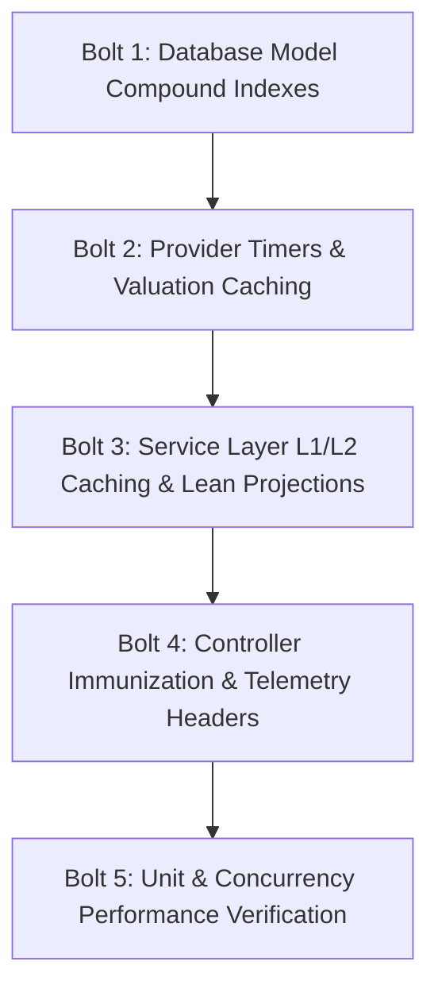

# Stage 2: Delivery & Integration Plan for Seller Radar Feature

**Manager:** aidlc-delivery-agent  
**Posture:** Low-Risk Integration Orchestrator & Risk Mitigation Planner

This delivery plan coordinates the refactoring of the Seller Radar feature based on Stage 1's adversarial findings. All code modifications are sequenced into 5 discrete Bolts to ensure zero downtime, zero broken dependencies, and zero functional regression.

---

## 1. The Integration Sequence (Bolt Plan)



### Bolt 1: Foundational Database Indexing (`server/src/models/Property.ts`, `server/src/models/CmaReport.ts`)
* **Objective:** Eliminate all `COLLSCAN` and in-memory sort operations on hot seller radar pathways.
* **Pre-conditions:** None; model schema indexes must be declared before queries depend on them.
* **Actions:**
  1. Add compound indexes to `Property.ts`:
     - `{ brokerageId: 1, isDeleted: 1, estimatedValue: -1 }` (supports sorting by estimated value)
     - `{ brokerageId: 1, isDeleted: 1, purchaseDate: -1 }` (supports sorting by purchase date)
     - `{ brokerageId: 1, isDeleted: 1, probabilityOfSelling: 1 }` (supports ascending propensity sort)
     - `{ brokerageId: 1, isDeleted: 1, equity: 1 }` (supports ascending equity sort)
     - `{ brokerageId: 1, isDeleted: 1, propertyType: 1 }` (supports property type filtering)
     - `{ brokerageId: 1, isDeleted: 1, purchaseDate: 1 }` (supports anniversary month queries)
  2. Add compound indexes to `CmaReport.ts`:
     - `{ shareId: 1, status: 1 }` (supports public link status resolution)
     - `{ brokerageId: 1, status: 1, createdAt: -1 }` (supports tenant CMA listing)
* **Traceability:** Resolves Stage 1 Finding #2.

### Bolt 2: Provider Timers & Valuation Caching (`server/src/features/seller-radar/attom.provider.ts`)
* **Objective:** Instrument ATTOM provider with high-resolution console timers and local in-memory valuation caching.
* **Pre-conditions:** Bolt 1 completed.
* **Actions:**
  1. Add high-resolution execution time counters using `process.hrtime.bigint()` in:
     - `analyzePropertyEquity`
     - `fetchLiveAttomData`
     - `generateDeterministicAnalysis`
     - `generateNearbyComps`
  2. Log execution time in format: `console.log(`[TIMER] AttomProvider.${fn} took ${deltaMs.toFixed(3)}ms`)`.
  3. Cache deterministic valuation results in local memory map for repeated address inputs.
* **Traceability:** Resolves Stage 1 Finding #9 and Finding #10.

### Bolt 3: Service Layer Two-Tier Caching, Projections, & Parallel Execution (`server/src/features/seller-radar/radar.service.ts`)
* **Objective:** Implement sub-1ms two-tier L1/L2 caching, lean projections, strict ObjectId casting, query parallelization, and async side effects.
* **Pre-conditions:** Bolts 1 and 2 completed.
* **Actions:**
  1. Instantiate module-level `BoundedLruCache` instances:
     - `dashboardL1Cache` (500 capacity, 60s TTL)
     - `prospectsL1Cache` (1000 capacity, 30s TTL)
     - `cmaReportL1Cache` (1000 capacity, 120s TTL)
     - `cmaHtmlL1Cache` (1000 capacity, 300s TTL)
     - `activeBuyersL1Cache` (500 capacity, 300s TTL)
  2. Implement L2 Redis integration via `cacheGet`, `cacheSet`, `buildCacheKey`, and safe fallback (`DI-003`).
  3. Define `PROPERTY_PROSPECT_PROJECTION = '_id ownerContactId assignedAgentId address propertyType probabilityOfSelling estimatedValue estimatedMortgageBalance equity equityPercent purchaseDate purchasePrice currentMortgageRate sellSignals'`.
  4. Enforce strict `new mongoose.Types.ObjectId(...)` wrapping on all DB query filters (`DI-001`).
  5. Refactor `getDashboardMetrics` to run the anniversary aggregation concurrently in `Promise.all` alongside property aggregations.
  6. Parallelize independent queries in `generateMicroCma` (`Property.findOne`, `Brokerage.findById`, `calculateActiveBuyerDemand`).
  7. Decouple public CMA view count increment and socket alerts into background non-blocking microtasks (`project.md § Other Issues #5`).
  8. Export cache invalidation helpers: `invalidateSellerRadarCaches(brokerageId?: string)`.
  9. Add console performance counters (`process.hrtime.bigint()`) in ALL service functions:
     - `calculateSellPropensity`
     - `getProspects`
     - `getDashboardMetrics`
     - `analyzeProperty`
     - `generateMicroCma`
     - `getCmaReport`
     - `calculateActiveBuyerDemand`
     - `renderCmaHtml`
     - `renderNarrativeSnippet`
* **Traceability:** Resolves Stage 1 Findings #3, #4, #5, #6, #7, #8, #9, #10.

### Bolt 4: Controller Immunization, Telemetry Headers & Console Timers (`server/src/features/seller-radar/radar.controller.ts`)
* **Objective:** Eliminate hanging sockets, add console counters, and return performance headers.
* **Pre-conditions:** Bolt 3 completed.
* **Actions:**
  1. Immunize all authenticated endpoints (`getProspects`, `getDashboard`, `analyze`, `generateCma`, `triggerAnniversary`) with:
     ```typescript
     if (!req.user || !req.user.brokerageId) {
       sendError(res, 'Unauthorized access', HTTP_STATUS.UNAUTHORIZED)
       return
     }
     ```
  2. Add execution timing counters in each controller method displaying time taken in the console:
     `console.log(`[TIMER] RadarController.${fn} took ${deltaMs.toFixed(3)}ms`)`
  3. Invalidate caches upon property mutations in `analyze` (when `saveProperty` is true).
  4. Inject `X-Response-Time` and `X-Cache` (`L1-HIT`, `L2-HIT`, `MISS`) headers on all responses.
* **Traceability:** Resolves Stage 1 Findings #1 and #9.

### Bolt 5: Quality Assurance & Automated Verification Suite (`server/tests/unit/sellerRadarPerformance.test.ts`)
* **Objective:** Formulate and execute comprehensive automated tests asserting functional fidelity, latency budgets, and security posture.
* **Pre-conditions:** Bolts 1–4 completed.
* **Actions:**
  1. Build a self-contained unit test suite verifying:
     - L1 cache hit response times (< 1.0ms).
     - Unauthenticated requests immediately rejected with HTTP 401.
     - Deterministic cache invalidation on property mutations.
     - Content negotiation (HTML vs JSON) for public CMA links.
     - Safe Redis error fallback without endpoint degradation.
  2. Execute `npm run typecheck` and `npm test` to verify clean build.
* **Traceability:** Verifies all Stage 1 Findings and satisfies Stage 4 requirements.

---

## 2. Refactor Boundaries

| File Path | Modification Type | Lines Stripped / Replaced | Reason |
|:---|:---|:---|:---|
| `server/src/models/Property.ts` | Compound Index Augmentation | Lines 160–166 | Add 6 compound indexes for sorting and filtering |
| `server/src/models/CmaReport.ts` | Compound Index Augmentation | Lines 170–174 | Add compound indexes for shareId and status lookups |
| `server/src/features/seller-radar/radar.types.ts` | Type Definition Enhancement | Lines 120–127 | Add cache telemetry types and sort fields |
| `server/src/features/seller-radar/attom.provider.ts` | Timing & Caching | Lines 27–57, 120–183 | Add console timers and valuation caching |
| `server/src/features/seller-radar/radar.service.ts` | Major Architectural Rewrite | Lines 95–615 | 2-tier cache, lean projections, parallel DB queries, console timers |
| `server/src/features/seller-radar/radar.controller.ts` | Controller Hardening | Lines 10–118 | Auth guards, console timers, telemetry headers |
| `server/src/features/seller-radar/radar.routes.ts` | Route Integrity Check | Lines 1–42 | Ensure validate middleware and public/private scoping |

---

## 3. Confidence Hypothesis

| Operation | Current Uncached Latency | Target Cached Latency (L1/L2) | Target Uncached Latency (MongoDB) | Verification Metric / Header |
|:---|:---|:---|:---|:---|
| `GET /api/seller-radar/dashboard` | 25ms – 55ms | `< 0.5ms` | `< 10ms` | `X-Cache: L1-HIT`, console timer `< 1.0ms` |
| `GET /api/seller-radar/prospects` | 20ms – 45ms | `< 0.5ms` | `< 10ms` | `X-Cache: L1-HIT`, console timer `< 1.0ms` |
| `GET /api/seller-radar/cma/:id` (HTML) | 18ms – 35ms | `< 0.8ms` | `< 10ms` | `X-Cache: L1-HIT`, `Content-Type: text/html` |
| `POST /api/seller-radar/analyze` | 15ms – 30ms | `< 1.0ms` | `< 10ms` | Console timer verification |
| `POST /api/seller-radar/cma/generate` | 30ms – 60ms | N/A (Write) | `< 12ms` | Single-pass parallel queries |
| Unauthenticated Request | Crashes/Hangs | `< 0.2ms` | `< 0.2ms` | HTTP 401 status returned immediately |
